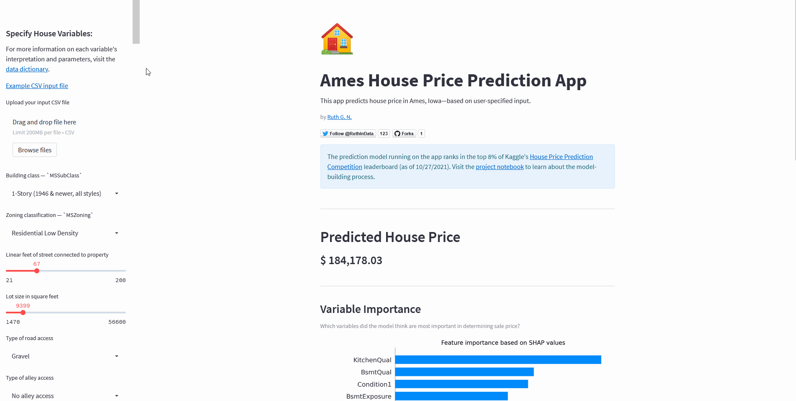

<h1 align="center">
    Ames Housing Price Prediction App 
</h1>

Demo: [](https://share.streamlit.io/ruthgn/ames-housing-price-prediction/main/ames-house-ml-app.py)

This web app showcases an XGBRegressor model trained to predict house prices in Ames, Iowa. To help a user understand the driving factors behind the prediction model, the user may specify inputs in the left panel and predicted outputs will be reflected in the main panel, followed by plots illustrating how each feature/variable drives the model output in a negative or positive direction (determined based on [SHAP values](https://towardsdatascience.com/one-feature-attribution-method-to-supposedly-rule-them-all-shapley-values-f3e04534983d)).


|  | 
|:--:| 
| *This app predicts house price in Ames, Iowa—based on user-specified input* |

## Model
Kaggle notebook outlining the model building process in full detail is available [here](https://www.kaggle.com/ruthgn/house-prices-top-8-featengineering-xgb-optuna/notebook).
This prediction model ranks in the top 7% of Kaggle's [House Price Prediction Competition leaderboard](https://www.kaggle.com/c/house-prices-advanced-regression-techniques/overview) and top 1% of [Housing Prices Competition for Kaggle Learn Users leaderboard](https://www.kaggle.com/c/home-data-for-ml-course/overview) (as of 12/20/2021—leaderboard refreshes every couple of months). 

## Data
The Ames Housing dataset was compiled by Dean De Cock for use in data science education. It's an incredible alternative for data scientists looking for a modernized and expanded version of the often cited Boston Housing dataset.

## Tech Stack
* Python
* Numpy
* pandas
* scikit-learn
* XGBoost
* [SHAP](https://shap.readthedocs.io/en/latest/index.html#)
* Streamlit


## Running The App Locally
Open a command prompt in your chosen project directory. Create a virtual environment with conda, then activate it.
```
conda create -n myenv python=3.9.7
conda activate myenv
```

Clone this git repo, then install the specified requirements with pip.
```
git clone https://github.com/ruthgn/Ames-Housing-Price-Prediction-App
cd Ames-Housing-Price-Prediction-App
pip install -r requirements.txt
```

Run the app.
```
streamlit run ames-house-ml-app.py
```

## License
This project is licensed under the GNU General Public License - see the [LICENSE](https://github.com/ruthgn/Ames-Housing-Price-Prediction-App/blob/main/LICENSE) file for details.